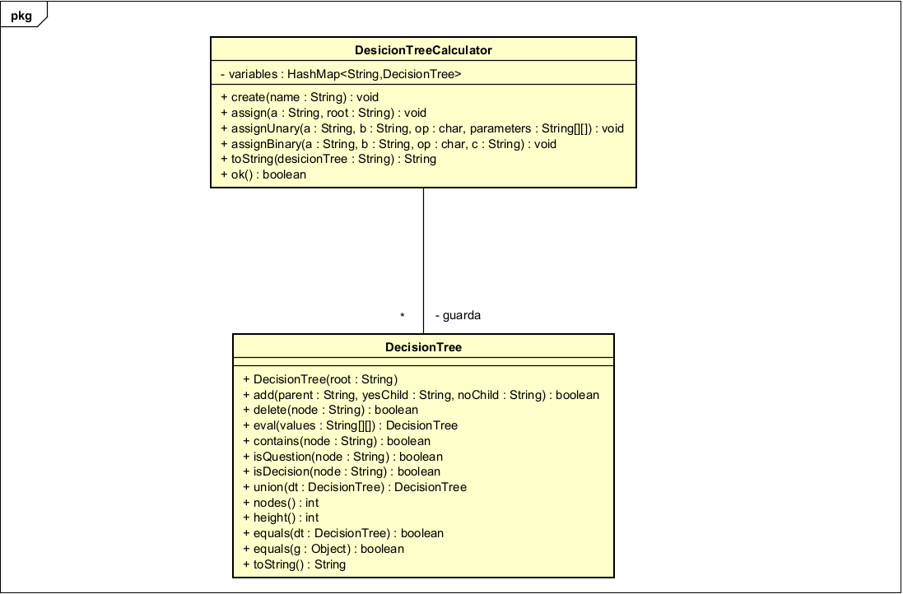
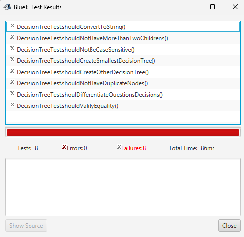
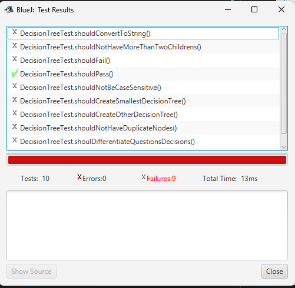

# Lab 02 - DOPO

> Hever Barrera Batero - Juan Diego Patiño Muñoz

## Conociendo el proyecto

1. Describir el proyecto en terminos de carpetas y extensiones
En la rama del proyecto esta un diagrama (posiblemente de clases) desarrollado
en Astah, tambien esta el propio proyecto en una carpeta llamada
'desicionTreeCalculator', alli encontramos los archivos `.java` junto a la
documentacion generada (carpeta `doc`)

2. Exploracion del proyecto en BlueJ

**TODO**

3. Generen y revisen la documentación del proyecto:
¿está completa la documentación de cada clase? (Detallen el
estado de documentación: encabezado y métodos)

**TODO**

4. Revisen las fuentes del proyecto, ¿en qué estado está cada clase?

(Detallen el estado de las fuentes considerando dos dimensiones: la
primera, atributos y métodos, y la segunda, código, documentación y
comentarios) ¿Qué diferencia hay entre el código, la documentación
y los comentarios?

**TODO**

## Ingenieria reversa

1. Completen el diagrama de clases correspondiente al proyecto.
(No incluyan la clase de pruebas)


2. ¿Cuáles contenedores están definidos? ¿Qué diferencias hay entre el nuevo

contenedor, el ArrayList y el vector [] que conocemos? Consulte el API de java.
mientras que `[]` guarda un numero especifico de elementos, `ArrayList` guarda
un numero indefinido de elementos, es decir se puede expandir

3. En el nuevo contenedor, ¿Cómo adicionamos un elemento? ¿Cómo lo

consultamos? ¿Cómo lo eliminamos?
Para adicionar usamos `.put(key, value)`, para obtener usamos `.get(key)` y
para elminar usamos `.remove(key)`

## Conociendo pruebas en BlueJ

1. Revisen el código de la clase DecisionTreeTest ¿cuáles etiquetas
tiene (componentes con símbolo @)? ¿cuántos métodos tiene? ¿cuantos métodos
son de prueba? ¿cómo los reconocen?

`@before`, `@test`, `@after`, hay 10 metodos, 8 metodos son tipo `@test`, por la etiqueta `@test`

2. Ejecuten los tests de la clase DecisionTreeTest. (click derecho sobre la
clase, Test All) ¿cuántas pruebas se ejecutan? ¿cuántas pasan? ¿por qué?


Ningun test tuvo exito

3. Estudie las etiquetas encontradas en 1 (marcadas con @). Expliqen en
sus palabras su significado.

* `@test`: una funcion que validara algo (hara un test)
* `@before`: lo que pasa antes de hacer los tests
* `@after`: lo que pasa despues de hacer los test

4. Estudie los métodos assertTrue, assertFalse, assertEquals, assertNull y
fail de la clase Assert del API JUnit 1

* `@assertTrue`: asgurarse que lo que haya dentro de los parentesis sea true
* `@assertFalse`: asgurarse que lo que haya dentro de los parentesis sea false
* `@assertEquals`: asgurarse que dos cosas sean iguales
* `@assertNull`: asgurarse que el retorno de lo que se llame sea null

5. Investiguen y expliquen la diferencia que entre un fallo y un error
en Junit. Escriba código, usando los métodos del punto 4., para codificar
los siguientes tres casos de prueba y lograr
que se comporten como lo prometen shouldPass, shouldFail, shouldErr.

* `Error`: Hubo un error en la ejecucion del codigo y el programa fallo
* `Failure`: Algun test dio false

```java
@Test
public void shouldPass ()
{
    assertEquals(4, 4);
}
    
@Test
public void shouldFail ()
{
    assertEquals(4, 5);
}    
```



## Practicando pruebas en BlueJ

1. Determinen los atributos de la clase DecisionTree. Justifique la selección.
